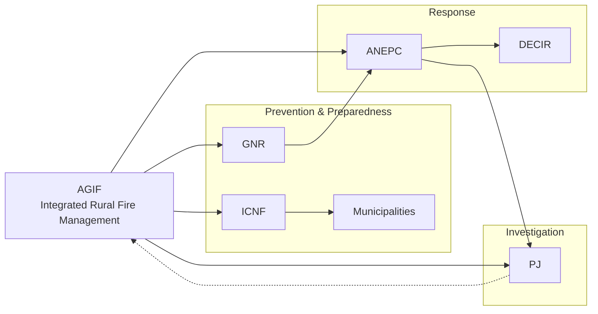

```mermaid
graph LR
  AGIF[AGIF\nIntegrated Rural Fire Management]

  subgraph PREV[Prevention & Preparedness]
    ICNF[ICNF]
    GNR[GNR]
    MUN[Municipalities]
  end

  subgraph RESP[Response]
    ANEPC[ANEPC]
    DECIR[DECIR]
  end

  subgraph INVEST[Investigation]
    PJ[PJ]
  end

  AGIF --> ICNF
  AGIF --> ANEPC
  AGIF --> GNR
  AGIF --> PJ

  ICNF --> MUN
  GNR --> ANEPC
  ANEPC --> DECIR
  ANEPC --> PJ

  PJ -.-> AGIF

```
