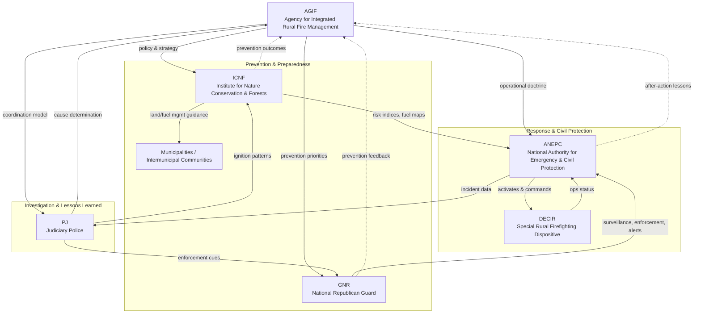

```mermaid
flowchart TB
  %% Top-level coordinator
  AGIF[AGIF\nAgency for Integrated Rural Fire Management]

  %% Functional areas
  subgraph PREV[Prevention & Preparedness]
    ICNF[ICNF\nInstitute for Nature Conservation & Forests]
    GNR[GNR\nNational Republican Guard]
    MUN[Municipalities / Intermunicipal Communities]
  end

  subgraph RESP[Response & Civil Protection]
    ANEPC[ANEPC\nNational Authority for Emergency & Civil Protection]
    DECIR[DECIR\nSpecial Rural Firefighting Dispositive]
  end

  subgraph INVEST[Investigation & Lessons Learned]
    PJ[PJ\nJudiciary Police]
  end

  %% Hierarchy / tasking from SGIFR coordinator
  AGIF -->|policy & strategy| ICNF
  AGIF -->|operational doctrine| ANEPC
  AGIF -->|prevention priorities| GNR
  AGIF -->|coordination model| PJ

  %% Prevention flows
  ICNF -->|risk indices, fuel maps| ANEPC
  ICNF -->|land/fuel mgmt guidance| MUN
  GNR -->|surveillance, enforcement, alerts| ANEPC

  %% Response flows
  ANEPC -->|activates & commands| DECIR
  DECIR -->|ops status| ANEPC

  %% Investigation flows
  ANEPC -->|incident data| PJ
  PJ -->|cause determination| AGIF
  PJ -->|ignition patterns| ICNF
  PJ -->|enforcement cues| GNR

  %% Feedback loops to strategy
  ANEPC -.->|after-action lessons| AGIF
  GNR -.->|prevention feedback| AGIF
  ICNF -.->|prevention outcomes| AGIF


```
